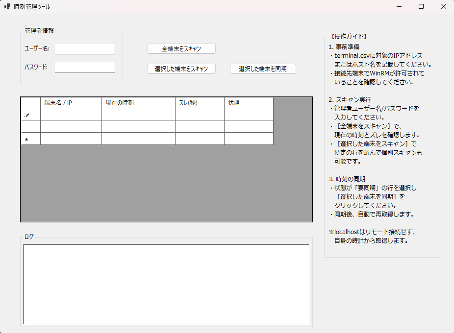

# ServerTimeSyncMaster (端末時刻同期マスター)

Windows端末の時刻を取得し、ホストPCとのズレを判定・同期するためのGUI管理ツールです。  
インフラ管理における複数端末の時刻確認作業を効率化するために開発しました。

## 開発の背景
システム運用・監視の現場において、NTPサーバーとの同期設定がなされているにもかかわらず、  
OSの不具合やネットワークの瞬断等によって同期が停止し、時刻が日に日にズレてしまうサーバーが存在しました。  

時刻の乖離はログの整合性や認証システムに重大な影響を及ぼすため、  
「異常な端末をいち早く検出し、その場で即座に修正できる」ことを目的として本ツールを開発しました。  

単に機能を実装するだけでなく、操作ガイドの常設や例外処理など、現場での「使い勝手」と「安全性」を重視して設計しています。

### 本ツールのコンセプト
- **早期発見**: 複数のサーバー・PCの状態を一括スキャンし、ミリ秒単位のズレを可視化します。
- **迅速な復旧**: 異常を発見したその場で、リモートから強制再同期コマンド (w32tm /resync) を発行できます。
- **汎用性**: サーバーOSだけでなく、WinRMを有効化したWindows 11等のクライアントPCの時刻管理にも対応しています。

## 主な機能

- **一括/個別スキャン**: 登録された全端末、または選択した特定の端末の現在時刻をリモート取得します。
- **時刻差分の自動判定**: ホストPCとの時刻差（秒）を計算し、1秒以上のズレがある場合は「要同期」として赤字で警告します。
- **リモート時刻同期**: `w32tm /resync` コマンドをリモート発行し、対象端末の時刻を強制的に同期させます。
- **localhost自動判別**: 実行PC自身（localhost）が対象に含まれる場合、通信エラーを避けるため自動的にローカルクロックから情報を取得します。
- **CSV連携**: 管理対象の端末リストを `terminal.csv` から自動的に読み込みます。

## 使用技術
- **言語**: C# ( .NET 10.0 / Windows Forms )
- **技術要素**: 
  - PowerShell SDK (System.Management.Automation)
  - WinRM (Windows Remote Management)
  - Async / Await (非同期処理によるUIフリーズ防止)

## 使い方

### 1. 準備
1. 実行ファイルと同じディレクトリに `terminal.csv` を作成してください。
   - `terminal.csv.example` をコピーしてリネームして使用できます。
   - 管理対象のIPアドレスまたはホスト名を1行ずつ記述してください。
2. 対象端末側で WinRM が有効であり、リモート接続が許可されていることを確認してください（`Enable-PSRemoting` 等）。

### 2. 実行
1. 本ツールを起動し、管理者権限を持つユーザー名とパスワードを入力します。
2. ［全端末をスキャン］ボタンで、リスト内の端末の状態を一括確認します。
3. 時刻がズレている行を選択し、［選択した端末を同期］ボタンをクリックして同期を実行します。